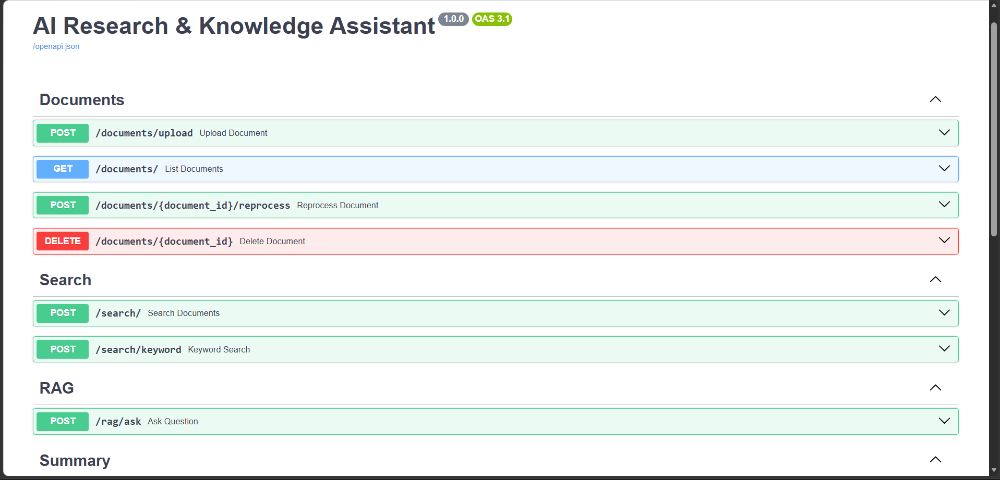
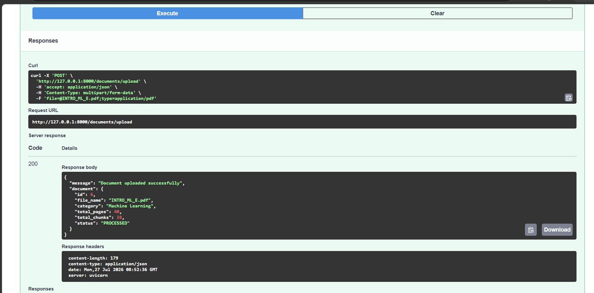
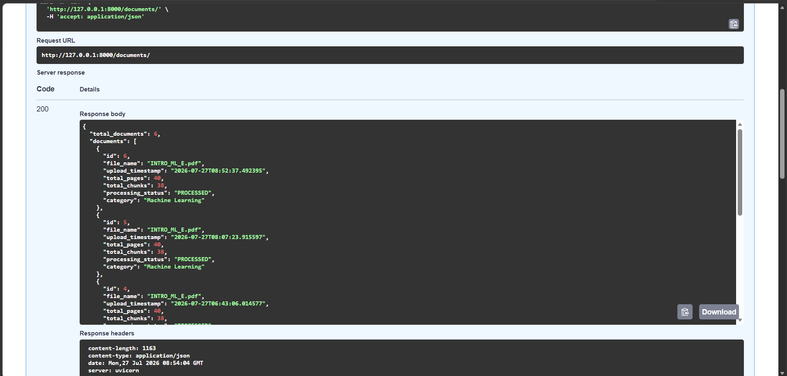
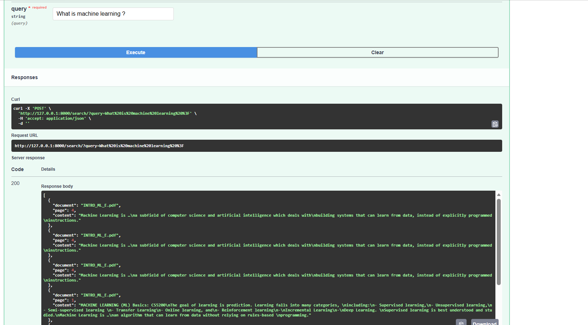
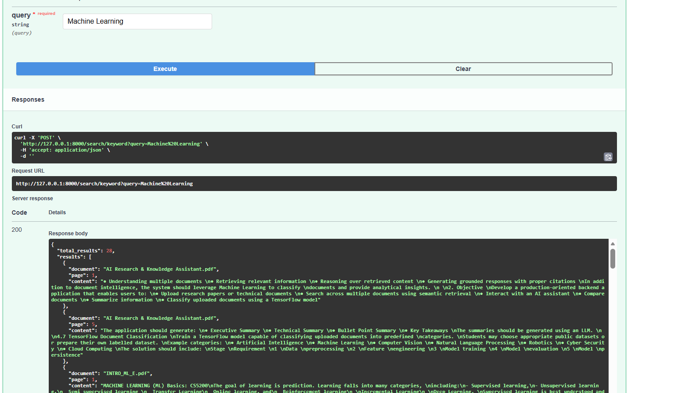
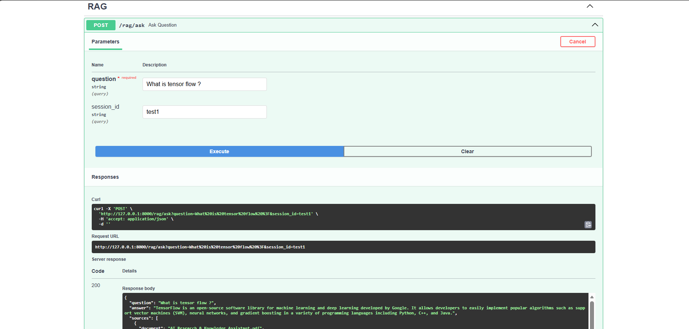
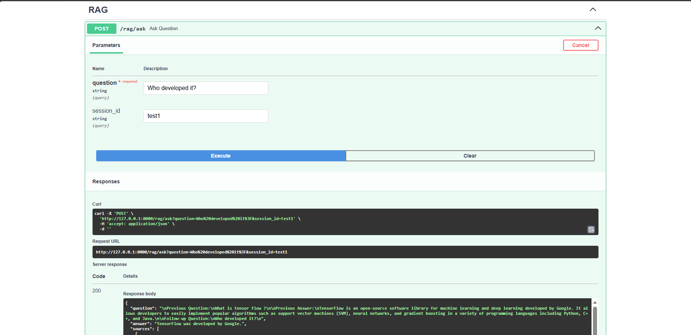
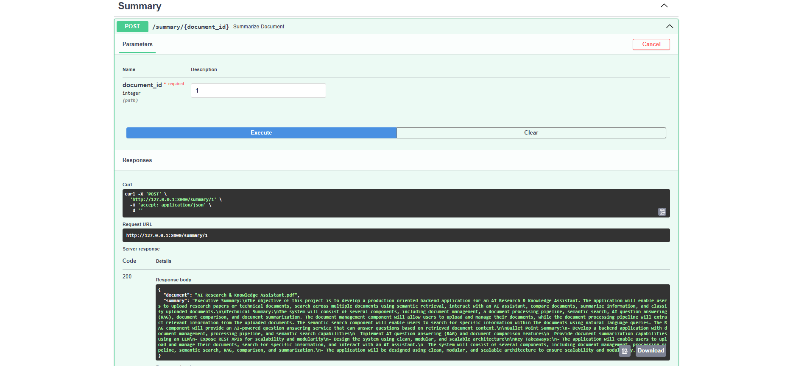
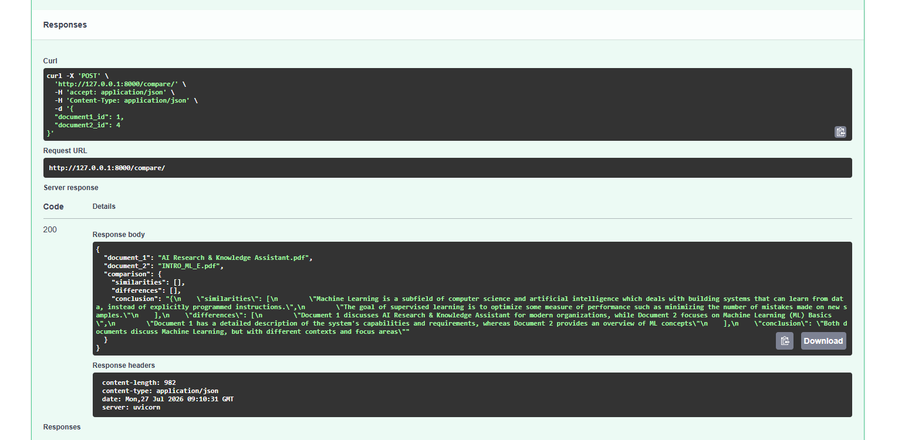
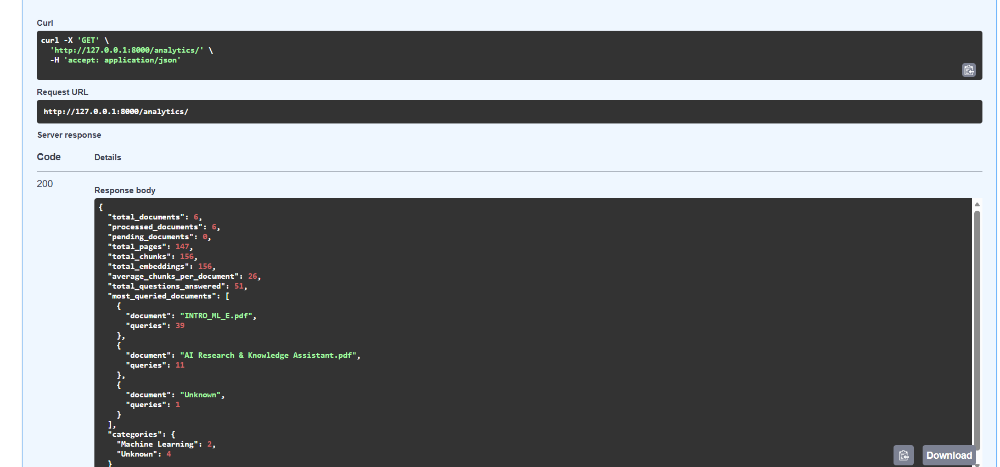

# AI Research & Knowledge Assistant

## Overview

AI Research & Knowledge Assistant is a production-oriented backend application built using FastAPI, TensorFlow, ChromaDB, Sentence Transformers, and Retrieval-Augmented Generation (RAG). The system enables users to upload technical or research documents, perform semantic and keyword search, interact with an AI-powered assistant, generate document summaries, compare multiple documents, and automatically classify uploaded documents using a TensorFlow model.

The project demonstrates modern AI application development by integrating document processing, vector search, Large Language Models, and Machine Learning into a modular REST API backend.

---

# Features

- PDF Upload and Processing
- Automatic Text Extraction
- Intelligent Text Chunking
- Document Metadata Management
- Semantic Search
- Keyword Search
- Retrieval-Augmented Generation (RAG)
- Conversation Memory
- Executive & Technical Summarization
- Bullet Point Summary
- Key Takeaways Generation
- Multi-document Comparison
- TensorFlow Document Classification
- Analytics Dashboard APIs
- Swagger/OpenAPI Documentation

---

# Technology Stack

| Technology | Purpose |
|------------|---------|
| Python | Programming Language |
| FastAPI | REST API Framework |
| TensorFlow | Document Classification |
| ChromaDB | Vector Database |
| Sentence Transformers | Embedding Generation |
| SQLite | Metadata Storage |
| SQLAlchemy | ORM |
| PyMuPDF | PDF Text Extraction |
| OpenAI API | Large Language Model |
| Uvicorn | ASGI Server |

---

# Project Structure

```
AI-Research-Knowledge-Assistant/
│
├── app/
│   ├── analytics/
│   ├── api/
│   ├── comparison/
│   ├── database/
│   ├── dataset/
│   ├── document_processing/
│   ├── embeddings/
│   ├── llm/
│   ├── memory/
│   ├── ml/
│   ├── rag/
│   ├── schemas/
│   ├── summarization/
│   ├── vectorstore/
│   └── main.py
│
├── models/
├── uploads/
├── screenshots/
├── requirements.txt
├── README.md
└── .env.example
```

---

# Installation

## Clone Repository

```bash
git clone https://github.com/KATTA-RAM-SAI-KUMAR/AI-Research-Knowledge-Assistant.git
```

## Navigate into Project

```bash
cd AI-Research-Knowledge-Assistant
```

## Create Virtual Environment

```bash
python -m venv venv
```

## Activate Virtual Environment

### Windows

```bash
venv\Scripts\activate
```

### Linux / macOS

```bash
source venv/bin/activate
```

## Install Dependencies

```bash
pip install -r requirements.txt
```

## Configure Environment Variables

Create a `.env` file in the project root.

Example:

```env
OPENAI_API_KEY=your_openai_api_key
```

## Run the Application

```bash
uvicorn app.main:app --reload
```

Swagger Documentation

```
http://127.0.0.1:8000/docs
```

---

# API Endpoints

## Document Management

- Upload Document
- List Documents
- Delete Document
- Reprocess Document

## Search

- Semantic Search
- Keyword Search

## RAG

- Ask Questions
- Conversation Memory

## Document Summarization

- Executive Summary
- Technical Summary
- Bullet Point Summary
- Key Takeaways

## Document Comparison

- Compare Multiple Documents

## Analytics

- Total Documents
- Processed Documents
- Total Pages
- Total Chunks
- Total Embeddings
- Most Queried Documents
- Category Distribution

---

# TensorFlow Document Classification

The project includes a TensorFlow model trained to classify uploaded documents into predefined categories.

Supported Categories:

- Artificial Intelligence
- Machine Learning
- Computer Vision
- Natural Language Processing
- Robotics
- Cyber Security
- Cloud Computing

Every uploaded document is automatically classified during the upload process.

---

# Architecture

```
PDF Upload
     │
     ▼
Text Extraction
     │
     ▼
Cleaning
     │
     ▼
Chunking
     │
     ▼
Embeddings
     │
     ▼
ChromaDB
     │
     ▼
Semantic Retrieval
     │
     ▼
Large Language Model
     │
     ▼
Generated Response
```

---

# Design Decisions

- FastAPI was selected for building high-performance REST APIs.
- ChromaDB was used for efficient semantic retrieval.
- Sentence Transformers generate high-quality embeddings.
- TensorFlow provides automatic document classification.
- SQLite stores lightweight document metadata.
- Modular architecture improves maintainability and scalability.

---

# Assumptions

- Only PDF documents are supported.
- Documents are processed immediately after upload.
- TensorFlow model is pre-trained before inference.
- ChromaDB stores vector embeddings locally.

---

# Limitations

- Supports only PDF documents.
- Authentication is not implemented.
- Multi-user support is not included.
- OCR for scanned PDFs is not implemented.
- Local storage is used for uploaded documents.

---

# Future Improvements

- Authentication & Authorization
- Docker Support
- OCR for Scanned Documents
- Hybrid Search (BM25 + Vector Search)
- Multi-user Support
- Cloud Deployment
- CI/CD Pipeline
- Streaming LLM Responses

---

# Screenshots

## Swagger API



---

## Upload Document



---

## List Documents



---

## Semantic Search



---

## Keyword Search



---

## RAG Question Answering



---

## Conversation Memory



---

## Document Summarization



---

## Document Comparison



---

## Analytics



---

# Author

**Ram Sai Kumar Katta**

Recent B.Tech Graduate | AI & Machine Learning Enthusiast | Python Developer